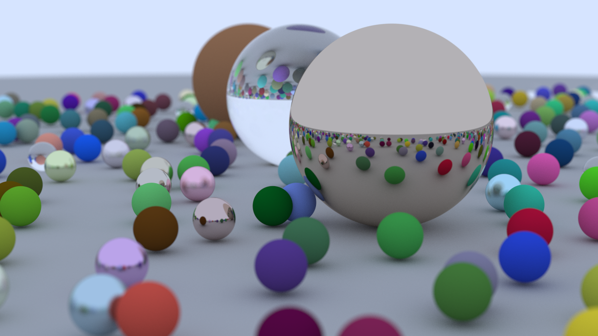
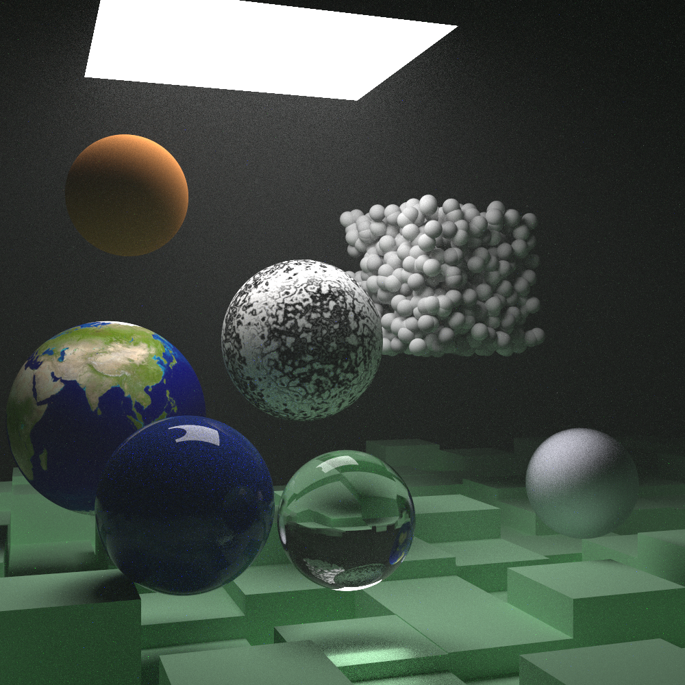

# Ray Tracing in One Weekend - C

With my renewed interest in C, I decided to re-do [Ray Tracing in One Weekend](https://raytracing.github.io/) in C. I might also use OpenGL/OpenCL in the future.

Other Ray Tracing in One Weekend repos:

- https://github.com/gau-nernst/ray-tracing-numba
- https://github.com/gau-nernst/ray-tracing-rust

On Linux and macOS

```bash
make main
make main ENABLE_OPENMP=1  # for OpenMP support
./main 0
```

The output is `output.tiff`. There are 8 scenes in total. Change `0` to `0-7` (inclusive) to select other scenes.

On MacOS, Apple Clang does not support OpenMP. Install LLVM from Homebrew to build with OpenMP.

```bash
brew install llvm
make main CC=$(brew --prefix llvm)/bin/clang ENABLE_OPENMP=1
```

On Windows

Download [`stb_image.h`](https://github.com/nothings/stb/blob/master/stb_image.h) and place it under `include/external`.

```bash
cl /Iinclude /Zc:preprocessor /std:c11 /O2 /fp:fast /Femain.exe src/*.c
cl /Iinclude /Zc:preprocessor /std:c11 /O2 /fp:fast /openmp /Femain.exe src/*.c  # for OpenMP support
./main.exe 0
```

## Gallery

Book 1 final scene. 2min 34s on Macbook Air M1, plugged in, with OpenMP and BVH. 1200x675. 1000 samples/pixel. max depth 50.



Book 2 final scene. 11min 10s on Macbook Air M1, plugged in, with OpenMP, BVH, and importance sampling. 1000x1000. 1000 samples/pixel. max depth 50.



## Learnings

**Implement `Vec3`**:
- Container: having `Vec3` be a union (C11) of a struct and an array makes it convenient to access individual fields explicitly or through a loop. Accessing inactive fields (i.e. fill values via struct members but access values via array) is allowed in C (no undefined behavior).
- Operations: since C does not support operator overloading, we have to implement each operation as a seperate function, including different combinations of operands (Vec3 + Vec3 or Vec3 + float), and explicitly call individual functions when we do calculations. The code can look very verbose, but we can improve it in two ways:
  1. Thanks to C11's `_Generic()`, we can define a macro to select an appropriate function based on operands type.
  2. We can use variadic macro magic (with `__VA_ARGS__`) to make + operation accept more than two operands. I got the solution from [this Stackoverflow answer](https://stackoverflow.com/a/11763277). Sadly, since C does not support recursive macro, we need to pre-define the maximum number of operands a `vec3_add()` macro can take. In my case, supporting up to 4 operands is enough.

**Pseudo-random generator (PRNG)**: I went to this repo [lemire/testingRNG](https://github.com/lemire/testingRNG) to look for a simple and fast PRNG. Since I'm using `float` instead of `double`, I only need a 32-bit PRNG. Moreover, since MSVC does not have a native 128-bit unsigned integer type (`__uint128_t` in GCC and Clang), I would need to write platform-conditioned code (MSVC has some compiler intrinsics to deal with 128-bit integers like `_mul128()`)

**Object-oriented programming** (OOP):
- Since the raytracing in one weekend series adopts an OOP style, I need to implement interface in C (in particular, for `Hittable`, `Material`, and `Texture`). From my research on the Internet, there are 3 main ways to do this:
  1. Add an enum tag as the first field of a struct, and class-specific data as subsequent fields. An interface's method will check this tag to call the appropriate function (using a `switch` statement).
  2. Store function pointers as the first few fields of a struct. There must be an initialization function to assign these function pointers correctly.
  3. Store address of a vtable in a struct. The vtable contains addresses of all methods of a class. This is similar to approach 2, but now each struct only needs to store 1 address. This is only beneficial if the interface has a lot of methods.
- In any approaches, we need to cast pointer type from interface pointer type to a particular class pointer type. This is unsafe since there is no guarantee that data in that address is from that valid class. If we need some elements of OOP, it's probably better to use a programming language that supports it natively i.e. C++ or Rust.
- I'm not sure if it's possible to write a useful (and simple to use) raytracer without OOP. We can have a list of primitive types (e.g. `Sphere`) and loop over it. However, with OOP, many features can be effortlessly implemented by referencing another object implementing an interface (e.g. `Translate`, or `Checker`).

**Importance sampling** (Book 3): I find this very interesting, perhaps because it involves beautiful math equations. 
- When we hit a surface of a particular material, the material's characteristics will dictate how the ray is scattered probabilistically. Note that since all of our materials obey a certain type of symmetry, scatter a ray from the camera is equivalent to scatter a ray from a light source (need checking). Mathematically, we try to calculate the following integral:
```math
color_i =  albedo \int_{\mathbf{r}} color_{i+1}(\mathbf{r}) p_{scatter}(\mathbf{r}) d\mathbf{r} =  albedo \cdot \mathbb{E}_{p_{scatter}}[color_{i+1}(\mathbf{r})]
```
- Note that $albedo$ and $p_{scatter}$ are material's characteristics. Also, we assume that $albedo$ does not depend on scattered rays. The expectation expression suggests that we can estimate this integral by sampling scattered rays according to $p_{scatter}(\mathbf{r})$ pdf and taking average of $color_{i+1}(\mathbf{r})$. This is what we have been doing in Book 1 and Book 2. By re-writing the integral expression, we can show that:
```math
color_i =  albedo \int_{\mathbf{r}} \frac{color_{i+1}(\mathbf{r}) p_{scatter}(\mathbf{r})}{p_{sampling}(\mathbf{r})} p_{sampling}(\mathbf{r}) d\mathbf{r} = albedo \cdot \mathbb{E}_{p_{sampling}} \left[ \frac{color_{i+1}(\mathbf{r}) p_{scatter}(\mathbf{r})}{p_{sampling}(\mathbf{r})} \right]
```
- Thus, we can estimate the same integral by sampling from another pdf of choice, and account for that by dividing by the pdf value. Note that $p_{sampling}$ shouldn't be zero when $p_{scatter}$ is non-zero (support of $p_{sampling}$ must contain support of $p_{scatter}$). But what $p_{sampling}(\mathbf{r})$ pdf should we use, and why? The idea is that noise/error in the final render is the standard deviation of our estimator. Since $\mathrm{Var}[X] = \mathbb{E}[X^2] - \mathbb{E}[X]^2$, and observing that the second term is the same either estimator, we only need to compare the first term.
```math
reduction \; in \; variance = \mathbb{E}_{p_{scatter}}[color_{i+1}(\mathbf{r})^2] - \mathbb{E}_{p_{sampling}}\left[\left( \frac{color_{i+1}(\mathbf{r}) p_{scatter}(\mathbf{r})}{p_{sampling}(\mathbf{r})} \right)^2\right]
```
```math
= \mathbb{E}_{p_{scatter}}[color_{i+1}(\mathbf{r})^2] - \mathbb{E}_{p_{scatter}} \left[ \frac{color_{i+1}(\mathbf{r})^2 \cdot p_{scatter}(\mathbf{r})}{p_{sampling}(\mathbf{r})} \right]
```
```math
= \mathbb{E}_{p_{scatter}} \left[ color_{i+1}(\mathbf{r})^2 \left( 1 - \frac{p_{scatter}(\mathbf{r})}{p_{sampling}(\mathbf{r})} \right) \right]
```
- Since $color_{i+1}(\mathbf{r})^2 \geq 0$, we want $p_{scatter}(\mathbf{r}) < p_{sampling}(\mathbf{r})$. However, since they are pdf, we can't have $p_{scatter}(\mathbf{r}) < p_{sampling}(\mathbf{r}), \forall \mathbf{r}$. Instead, we need to make a trade-off: we let $p_{scatter}(\mathbf{r}) < p_{sampling}(\mathbf{r})$ when $color_{i+1}(\mathbf{r})^2$ is large, and $p_{scatter}(\mathbf{r}) > p_{sampling}(\mathbf{r})$ when $color_{i+1}(\mathbf{r})^2$ is small, so that on average, we obtain a reduction in variance. It implies that we should **sample towards light sources more frequently than sampling other directions**. This is the key of importance sampling. Also, sampling towards light sources is a heuristics, not a guarantee, that we will get larger ray color values.
- Note that we can't always sample towards light sources, since $p_{sampling}$ might be zero when $p_{scatter}$ is not zero. A simple trick is to use a mixture of distributions: sample p% towards light sources, and (1-p)% with scatter pdf; the resulting pdf is the weighted average of the density functions.
